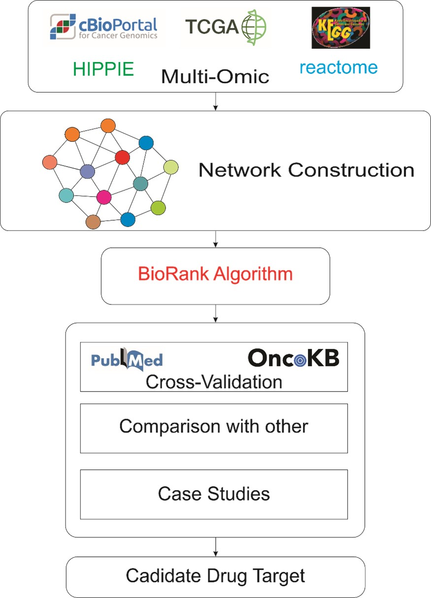

# 🧬 BioRank: Enhanced PageRank for Cancer Gene Prioritization

> A GUI-based tool for integrating multi-omics data to prioritize cancer-related genes using Original and Enhanced PageRank algorithms.

---

## 👤 Author

**Nguyen Huu Tam**, **Pham Duc Tinh**, **Pham Van Hai**  
📧 Email: [tamkadinner@gmail.com](mailto:tamkadin@gmail.com)  
🏛️ Project: BioRank, 2025
---

## 📚 Citation

This project, **BioRank**, was developed based on and extends the methods proposed in the following publication:

> M. Gentili, L. Martini, M. Sponziello, and L. Becchetti,  
> *"Biological Random Walks: Multi-Omics Integration for Disease Gene Prioritization"*,  
> *Bioinformatics*, vol. 38, no. 17, pp. 4145–4152, 2022.  
> [https://doi.org/10.1093/bioinformatics/btac446](https://doi.org/10.1093/bioinformatics/btac446)

The original source code is available at:  
🔗 [https://github.com/LeoM93/BiologicalRandomWalks](https://github.com/LeoM93/BiologicalRandomWalks)

**BioRank** enhances and expands their framework by providing:

- An intuitive graphical user interface (GUI) that enables biomedical researchers to run analyses without coding
- Integration of both the original and enhanced **PageRank algorithms** for gene prioritization
- Evaluation and validation of prioritized genes against curated cancer knowledgebases such as **OncoKB**
- Exportable outputs and automated workflows for reproducibility and downstream analysis

If you use **BioRank** or its underlying methods in your work, please cite both the original publication and this project.

## 📘 Introduction

Recent studies have shown that PageRank-based approaches can help identify disease-related genes from biological networks. However, traditional methods mainly rely on network topology and overlook vital biological factors such as gene expression, functional annotations, and similarity between gene pairs. In this study, we propose an Enhanced PageRank algorithm that integrates multi-omics data—including PPI networks, co-expression, gene ontology (GO, KEGG, Reactome), and differentially expressed genes—into a unified framework. By modifying the personalization vector and applying weighted diffusion, our method improves the ability to prioritize cancer-related genes more accurately than classical PageRank and other network propagation approaches.

<p align="center">
  
</p>

## 🖥 Application Overview

**BioRank** is a Python-based GUI application built with Tkinter to enable biomedical researchers to:

- Run **Original** and **Enhanced PageRank** for gene prioritization  
- Perform step-by-step **biological data preprocessing**  
- Integrate data from PPI, co-expression networks, and ontologies  
- Export ranked gene outputs  

The GUI includes:

- **Left Panel** – Run PageRank  
- **Right Panel** – Preprocessing functions (ontology, co-expression, TCGA parsing)

---

## 🚀 Features

| Function                            | Description                                                                 |
|-------------------------------------|-----------------------------------------------------------------------------|
| 🎯 Run PageRank (Original/Enhanced) | PageRank ranking over integrated biological networks                     |
| 🧠 Ontology Graph Construction       | Combine GO, KEGG, Reactome into a unified bipartite ontology graph          |
| 🧬 Disease Ontology Enrichment       | Enrich disease-specific annotations from seed genes                         |
| 📊 DE Genes + Co-expression          | Identify DE genes & build correlation-based co-expression networks          |
| 🧫 TCGA Parser                       | Generate tumor/control expression tables from GDC/manifest and RNA-seq data |

---

## 📦 Requirements

**Python Version:** 3.7 or higher

Install required dependencies:

```
pip install -r requirements.txt
```
## 📂 Project Structure
```
BioRank/
├── main.py                 # GUI Launcher  
├── improved_pagerank/             # Core PageRank algorithms  
├── data_preprocessing/            # Data processing scripts  
├── output/                        # Generated outputs  
├── dataset/                       # Dataset folder 
├── README.md                      # This documentation  
└── requirements.txt  
```
## 🖱 How to Launch GUI
To start the GUI, run the following command in your terminal:
```
python main.py
```
## ⚙️ Data Preprocessing Functions
### 1. 🧱 Build Ontology Graph
Required Input Files:
```
    - GO .gaf File
    - KEGG File
    - Reactome File
    - Uniprot-Ensembl Mapping File
    - KEGG-Uniprot Mapping File
```
### 2. 🧬 Disease-Specific Ontology Enrichment
Required Input Files:
```
    - Ontology Graph File
    - Seed Genes File
```
### 3. 🔬 Differentially Expressed Genes + Co-expression
Required Input Files:
```
    - Tumor Expression Table
    - Control Expression Table
    - Identifier File
```
### 4. 🧫 TCGA Tumor-Control Table Generation
Required Input Files:
```
    - GDC Sample Sheet
    - Manifest File
    - RNA-seq Directory
    - Output Directory
```
## 🔁 Run PageRank
Run PageRank in the GUI. Required Input Files:
```
  -p ppi.tsv \
  -c coexpr.tsv \
  -s seed_genes.txt \
  -de de_genes.tsv \
  -a ontology.tsv \
  -do disease_specific_ontology.txt \
```

